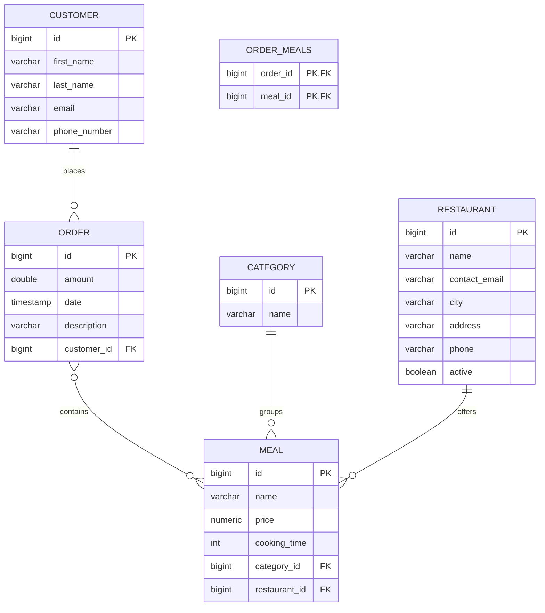

# ER Diagram

## PK/FK summary

- `orders.customer_id -> customers.id`
- `meals.category_id -> categories.id`
- `meals.restaurant_id -> restaurants.id`
- `order_meals.order_id -> orders.id`
- `order_meals.meal_id -> meals.id`
